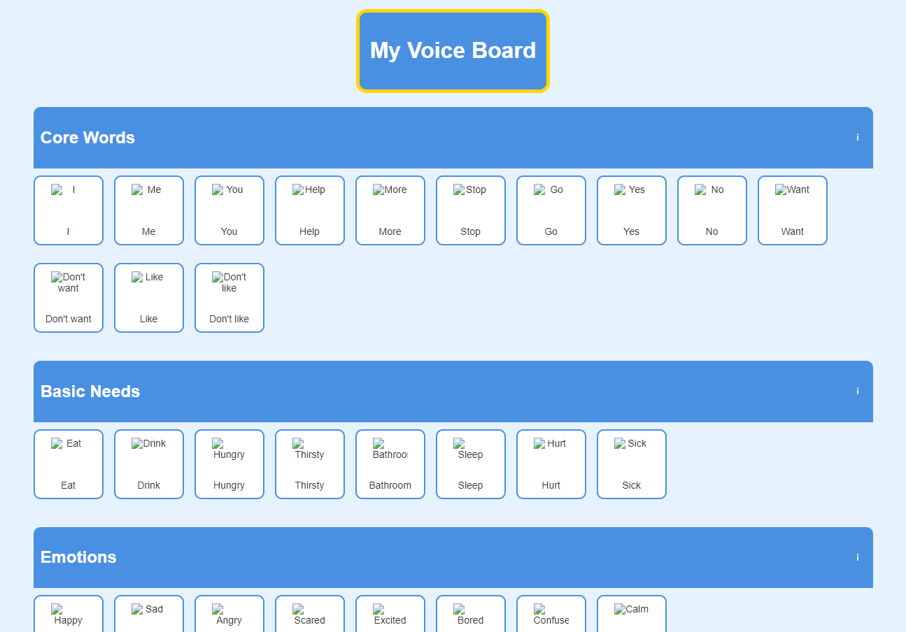

# My Voice Board



## Description

My Voice Board is an Augmentative and Alternative Communication (AAC) web application designed to assist individuals with speech and language impairments. This easy-to-use, customizable communication board allows users to express themselves by selecting symbols that represent words, phrases, or concepts.

## Features

- Responsive design that works on desktop and mobile devices
- Multiple categories of symbols for various communication needs
- Text-to-speech functionality for spoken output
- Easy to customize and extend with new symbols and categories
- Accessible design with keyboard navigation and screen reader support

## How It Works

1. The board displays various categories of symbols.
2. Users can navigate through categories and select symbols.
3. When a symbol is selected, the associated word or phrase is spoken aloud using text-to-speech.
4. An information button in each category allows users to request new symbols or features.

## Installation

1. Clone this repository:
   ```
   git clone https://github.com/f47e/my-voice-board.git
   ```
2. Navigate to the project directory:
   ```
   cd my-voice-board
   ```
3. Open `aac-communication-board.html` in a web browser.

## Customization

### Adding New Symbols

1. Create a new image for your symbol and save it in the `symbol-images` folder.
2. The image should be named using the lowercase version of the symbol name, with spaces replaced by hyphens (e.g., "new-symbol.png").
3. Add the new symbol to the appropriate category in the `categories` array in the `<script>` section of `aac-communication-board.html`.

### Adding New Categories

1. Add a new object to the `categories` array in the `<script>` section of `aac-communication-board.html`.
2. Follow the existing format: `{ name: "Category Name", symbols: ["Symbol1", "Symbol2", ...] }`.

## Contributing

We welcome contributions to My Voice Board! If you have suggestions for new features, symbols, or improvements, please open an issue or submit a pull request.

## License

This project is licensed under the MIT License - see the [LICENSE.md](LICENSE.md) file for details.

## Acknowledgments

- Thanks to all contributors and users of My Voice Board.
- Special thanks to the AAC community for their invaluable feedback and support.
